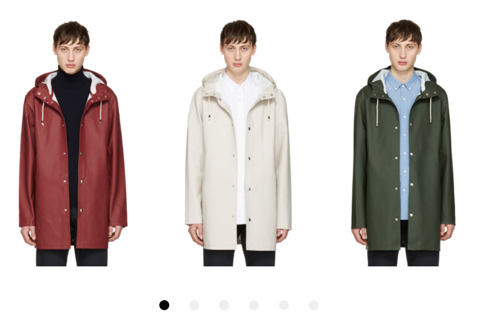
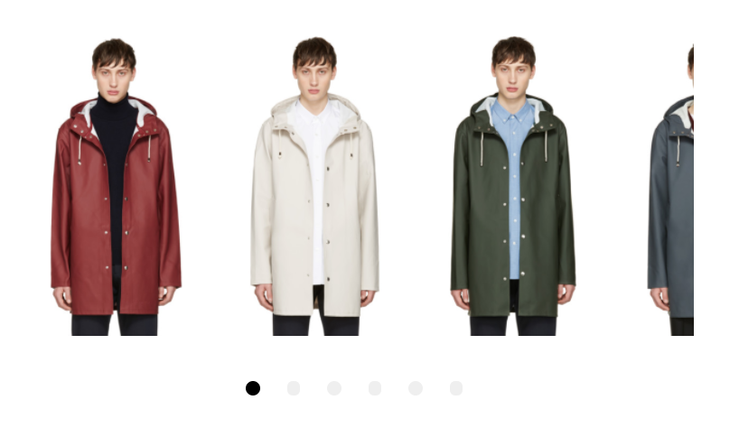
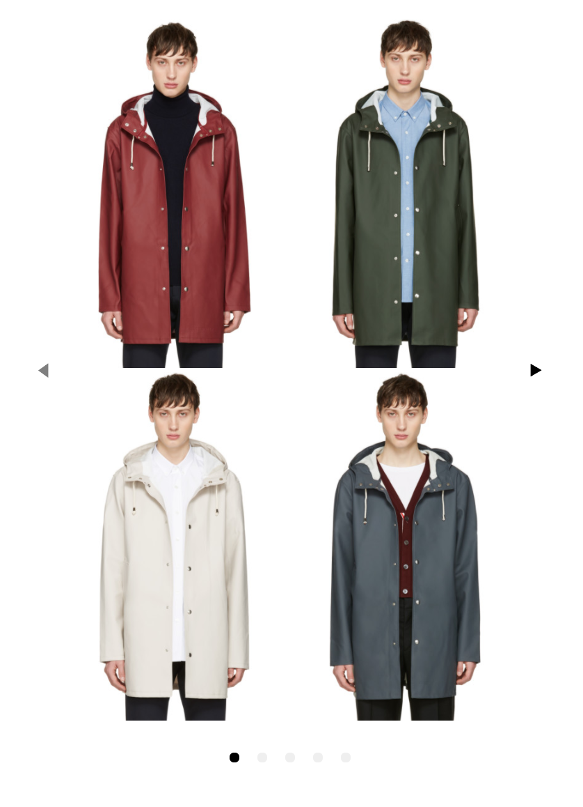
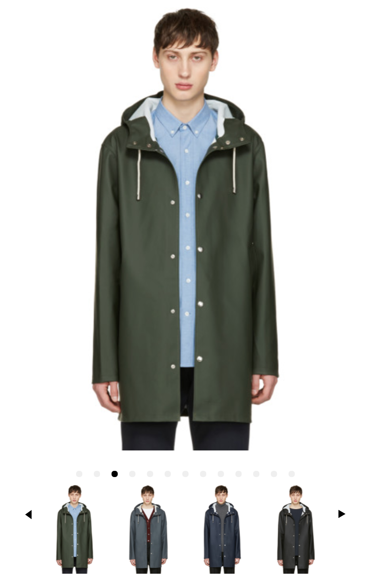

# VueML Carousel

## Table of Contents
- [Usage](#usage)
- [Development](#development)
- [License](#license)

## Basic Usage
This is the simplest version of the carousel using the default values for the above parameters.



``` html
<vueml-carousel :per-page="3">
  <vueml-slide>Content</vueml-slide>
  <vueml-slide>Content</vueml-slide>
  <vueml-slide>Content</vueml-slide>
</vueml-carousel>
```
Add a class for using specific styles.
``` html
<vueml-carousel :class="yourclassname">
  <vueml-slide>Content</vueml-slide>
  <vueml-slide>Content</vueml-slide>
  <vueml-slide>Content</vueml-slide>
</vueml-carousel>
```

## Card Peek
Card peek is achieved by using a decimal point in the per-page or per-page-custom attributes.



``` html
<vueml-carousel :per-page="3.4">
  <vueml-slide>Content</vueml-slide>
  <vueml-slide>Content</vueml-slide>
  <vueml-slide>Content</vueml-slide>
</vueml-carousel>
```
Per-page-custom example:
``` html
<vueml-carousel :per-page-custom="[[768,3.4],[1024,4.4]]">
  <vueml-slide>Content</vueml-slide>
  <vueml-slide>Content</vueml-slide>
  <vueml-slide>Content</vueml-slide>
</vueml-carousel>
```


## Multi-Row Slides
Adding the slide-rows attribute will signal the carousel to re-organize the slides into multiple rows. Each slide is placed in order based on the number of rows.

For example, if the slide-rows attribute is set to "2", the first two slides given will be orderd top/bottom of the new first slide as seen below:



``` html
<vueml-carousel :slide-rows="2" :navigation-enabled="true">
  <vueml-slide>Content</vueml-slide>
  <vueml-slide>Content</vueml-slide>
  <vueml-slide>Content</vueml-slide>
</vueml-carousel>
```

## Thumbnail Navigation
When activated, the thumbnail navigation sets the main carousel to 1 slide per page. It then adds the slides to a new carousel directly below the main carousel. Both carousels work in tandem. The main carousel does not initialize the navigation. Navigation is enabled on the thumbnail carousel. Navigating, swiping or clicking items in the thumbnail carousel will update the main carousel.



``` html
<vueml-carousel :thumb-nav-enabled="true" :thumb-nav-per-page="4">
  <vueml-slide>Content</vueml-slide>
  <vueml-slide>Content</vueml-slide>
  <vueml-slide>Content</vueml-slide>
</vueml-carousel>
```
You will need to update thumbnail slide content css separately from your main slide content. This is especially important if you are using special content such as videos or a mixture of images and text.

``` css
.VueMLCarousel-ThumbNav {

  .VueMLCarousel-ThumbNav-wrapper {

    .VueMLCarousel-ThumbNav-inner {

      .VueMLCarousel-slide {

      }
    }
  }
}
```
## Configuration
| Property                  | Type    | Default | Description                                                                                                                                                                                                                                                                           |
|:--------------------------|:--------|:--------|:--------------------------------------------------------------------------------------------------------------------------------------------------------------------------------------------------------------------------------------------------------------------------------------|
| easing                    | String  | ease    | Slide transition easing. Any valid CSS transition easing accepted.                                                                                                                                                                                                                    |
| minSwipeDistance          | Number  | 8       | Minimum distance for the swipe to trigger a slide advance.                                                                                                                                                                                                                            |
| navigationClickTargetSize | Number  | 8       | Amount of padding to apply around the label in pixels.                                                                                                                                                                                                                                |
| mouseDrag                 | Boolean | true    | Flag to toggle mouse dragging.                                                                                                                                                                                                                                                        |
| navigationEnabled         | Boolean | false   | Flag to render the navigation component (next/prev buttons).                                                                                                                                                                                                                          |
| navigationNextLabel       | String  | ▶       | Text content of the navigation next button.                                                                                                                                                                                                                                           |
| navigationPrevLabel       | String  | ◀       | Text content of the navigation prev button.                                                                                                                                                                                                                                           |
| paginationActiveColor     | String  | #000000 | The fill color of the active pagination dot. Any valid CSS color is accepted.                                                                                                                                                                                                         |
| paginationColor           | String  | #efefef | The fill color of pagination dots. Any valid CSS color is accepted.                                                                                                                                                                                                                   |
| paginationEnabled         | Boolean | true    | Flag to render pagination component.                                                                                                                                                                                                                                                  |
| paginationPadding         | Number  | 10      | The padding inside each pagination dot. Pixel values are accepted.                                                                                                                                                                                                                    |
| paginationSize            | Number  | 10      | The size of each pagination dot. Pixel values are accepted.                                                                                                                                                                                                                           |
| perPage                   | Number  | 2       | Maximum number of slides displayed on each page.                                                                                                                                                                                                                                      |
| perPageCustom             | Array   |         | Configure the number of visible slides with a particular browser width. This will be an array of arrays, ex. [[320, 2], [1199, 4]]. Formatted as [x, y] where x=browser width, and y=number of slides displayed. Ex. [1199, 4] means if (window <= 1199) then show 4 slides per page. |
| resistanceCoef            | Number  | 20      | Resistance coefficient to dragging on the edge of the carousel. This dictates the effect of the pull as you move towards the boundaries.                                                                                                                                              |
| scrollPerPage             | Boolean | true   | Scroll per page, not per item.                                                                                                                                                                                                                                                        |
| speed                     | Number  |         | Slide transition speed. Number of milliseconds accepted.                                                                                                                                                                                                                              |
| loop                      | Boolean | false   | Flag to make the carousel loop around when it reaches the end.                                                                                                                                                                                                                        |
| navigateTo                | Number  | 0       | Listen for an external navigation request using this prop.                                                                                                                                                                                                                            |
| spacePadding              | Number  | 0       | Stage padding option adds left and right padding style (in pixels) onto VueMLCarousel-inner.                                                                                                                                                                                            |
| thumbNavEnabled              | Boolean  | false       | Flag to make the carousel use a thumbnail navigation below the carousel.                                                                                                                                                                                            |
| thumbNavPerPage             | Number  | 4       | Maximum number of slides displayed on each page                                                                                                                                                                                            |
| thumbNavPerPageCustom       | Array  |        | Configure the number of visible slides with a particular browser width. This will be an array of arrays, ex. [[320, 2], [1199, 4]]. Formatted as [x, y] where x=browser width, and y=number of slides displayed. Ex. [1199, 4] means if (window <= 1199) then show 4 slides per page.                                                                                                                                                                                         |
| slideRows              | Number  | 1       | Automatically re-organizes slide content into multiple rows from the given group of slides.                                                                                                                                                                                            |

## Development

A sandboxed dev environment is provided by [vue-play](https://github.com/vue-play/vue-play). Changes made to the component files will appear in real time in the sandbox.

To begin development, run:

``` bash
npm install
npm run dev
```

or, if you prefer yarn

``` bash
yarn install
yarn dev
```

then navigate to `http://localhost:5000`

To modify and add sandbox scenarios, edit `play/index.js`

## License

This project is licensed under the MIT License - see the [LICENSE.md](LICENSE.md) file for details.
